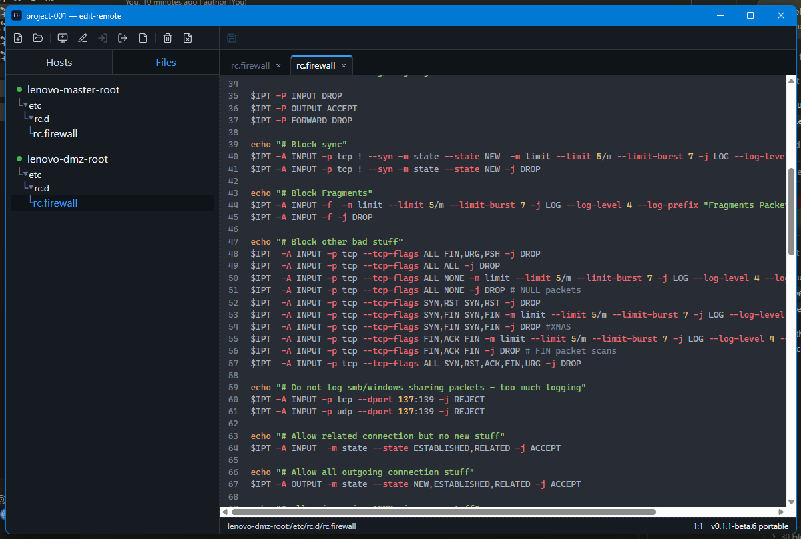

# edit-remote

A desktop editor for text files on remote machines. Each open file belongs to its own host and is loaded and saved over SFTP. There is no single remote workspace: the same path can be open on two hosts at once.



Hosts are shared. A named project (`.erproj`) remembers which files you opened on which host. The side panel lists those paths, not the whole remote disk. Opening a file browses that host, then keeps the file in the project for later. The editor is tabbed. A tab shows the short file name; the status bar shows `alias:/path`.

- Connect with a private key. The passphrase stays in the OS credential store, not in the project file.
- A new host can be filled from `~/.ssh/config`.
- Unknown host keys are shown and stored only after you accept them.
- Tabs keep their place. Ctrl+Tab switches between the last two. Alt+1 through Alt+9 pick a tab by position.
- The portable build keeps its settings in a `config` folder next to the exe.

Windows (NSIS setup and portable) and Linux (AppImage and .deb) builds are published from `master`.

## Develop

```bash
pnpm install
pnpm run dev
```
